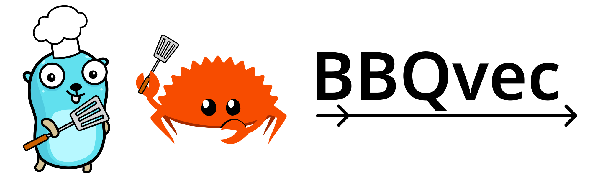

[](LICENSE)
[](https://godoc.org/github.com/daxe-ai/bbqvec)
[](https://crates.io/crates/bbqvec)

BBQvec is an open-source, embedded vector database index for Go and Rust, providing approximate K-nearest-neighbors (aKNN).

[Read more about the algorithm!](https://example.com)

# Getting Started

## Go

```go
package main

import (
  "fmt"

  bbq "github.com/daxe-ai/bbqvec"
)

func main() {
  // Declare store parameters
  dimensions := 200
  nBasis := 10

  // Initialize the store
  backend := bbq.NewMemoryBackend(dimensions)
  datastore, _ := bbq.NewVectorStore(backend, nBasis)

  // Create some test data, 100K random vectors
  vecs := bbq.NewRandVectorSet(100_000, dimensions, nil)
  datastore.AddVectorsWithOffset(0, vecs)
  /*
  Equivalent to:
  for i, v := range vecs {
  datastore.AddVector(bbq.ID(i), v)
  }
  */

  // Run a query
  targetVec := bbq.NewRandVector(dimensions, nil)
  results, _ := datastore.FindNearest(targetVec, 10, 1000, 1)

  // Inspect the results
  top := results.ToSlice()[0]
  vec, _ := backend.GetVector(top.ID)
  fmt.Println(top.ID, vec, top.Similarity)
}
```

## Rust

```rust
use bbqvec::IndexIDIterator;

fn main() -> Result<()> {
  // Declare store parameters
  let dimensions = 200;
  let n_basis = 10;

  // Initialize the store
  let mem = bbqvec::MemoryBackend::new(dimensions, n_basis)?;
  let mut store = bbqvec::VectorStore::new_croaring_bitmap(mem)?;

  // Create some test data, 100K random vectors
  let vecs = bbqvec::create_vector_set(dimensions, 100000);
  store.add_vector_iter(vecs.enumerate_ids())?;

  // Run a query
  let target = bbqvec::create_random_vector(dimensions);
  let results = store.find_nearest(&target, 10, 1000, 1)?;

  // Inspect the results
  for res in results.iter_results() {
    println!("{} {}", res.id, res.similarity)
  }
}

```

# TODOs
## Go
[ ] More benchmarks
## Rust
[ ] Disk backend
[ ]


### Acknowledgements
Thank you to MariaLetta for the [free-gophers-pack](https://github.com/MariaLetta/free-gophers-pack) and to [rustacean.net](https://rustacean.net) for the CC0 logo characters.
